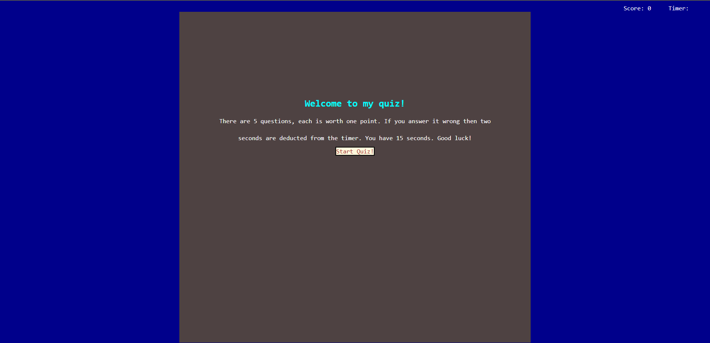

## <Challenge 4>

## Description

- My motivation to build this project was to give others a quiz to polish up on javascript skills.
- I built this project so that I could have a test about basic javascript knowledge to brush up every once in awhile.
- I learned how to deal with local storage, traverse the DOM with javascript elements, and show/hide different entire sections dependant on what the current interface needed.

## Installation

- Visit https://mitchell4563.github.io/Challenge-04/

## Usage

- Upon loading the page, there will be some short instructions followed by a start quiz button. When you click that start button the timer will start and the quiz will begin.

## License

- Please refer to the license in the repo.
